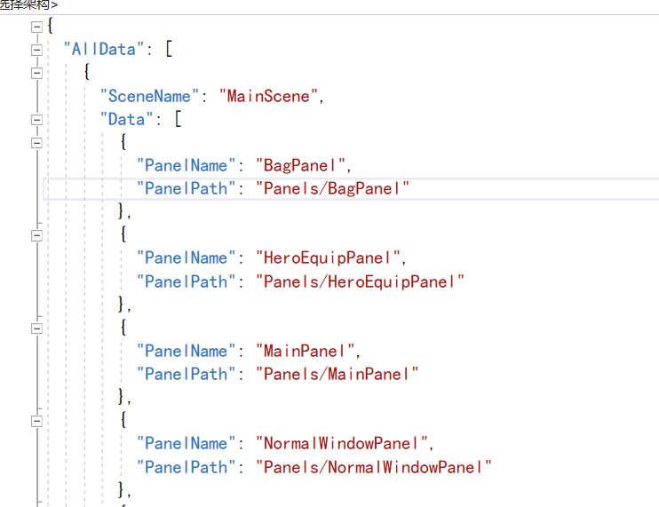

# UI框架整体设计思路

## 1.主要功能

- 显示一个面板
- 面板上面的按钮等物品可以交互
- 面板进入/暂停/恢复/退出时可以执行不同的效果

### 显示一个面板

- 用户通过面板的名字就可以显示一个面板
- 要找到正确的面板
- 一个面板对应一个UIType，UIType中存储着一个面板的名字和地址
- 通过这个UIType来获取到面板的模块UIModuleBase，这个面板模块控制着面板OnEnter()，OnPause()，OnResume()，OnExit()
- 通过UIType来获取UIModuleBase的过程中通过uitype中的地址来创建面板。
- 然后直接新创建的面板的OnEnter()

#### UIType

- UIType通过UITypeManager来管理，UITypeManager会创建一个字典来存储已经实例化的uitype，这个类中有公共方法public UIType GetUIType(string uiPanelName)
- 通过传入一个ui面板的名字来获取到这个面板的uitype，当这个uitype在字典中时，返回字典中的uitype，如果字典中不存在，则会实例化一个新的uitype，并将新实例化的uitype存入字典
- 获取uitype的地方一般只有在public void PushUI(string uiPanelName)中使用，通过获取的uitype来获取ui模块
- 实例化一个uitype需要传入这个面板的地址
- 地址存放在一个json配置文件中

##### json配置文件

- json配置文件需要通过JsonDataManager来解析才能获取正确的地址
- 配置文件中的格式如图，通过SceneName来存储不同场景的panel的Name和Path
- 
- 在JsonDataManager中用一个字典来存储这个内容
- private Dictionary<int, Dictionary<string, string>> panelDataDic;
- 前面的int来存储不同的场景的panel，后面的字典来存储Name和Path
- 对json进行解析第一个要获取json配置文件的地址，json配置文件的地址不会变，所以通过SystemDefine来定义一个const
- 通过AssetsManager中的GetAsset，传入一个地址来返回对应的对象
- 定义一个jsonPanelMode来存储解析后的json对象,如下所示

```csharp
[Serializable]
    public class JsonPanelMode 
    {
        public SceneDataModel[] AllData;
    }
    [Serializable]
    public class SceneDataModel
    {
        public string SceneName;
        public PanelDataModel[] Data;
    }
    [Serializable]
    public class PanelDataModel
    {
        public string PanelName;
        public string PanelPath;
    }
``````

- 通过两层嵌套来存储解析后的json信息，然后在解析后遍历这个，存入JsonDataManager中定义好的字典中，方便使用。
- 创建一个对外公开的方法，通过id和Name来返回Name对应的path

#### UIModuleBase

- 这个是所有panel模块的基类，实现了一些面板的通用方法，所有面板上必须存在UIModuleBase或者其子类
- 这个类主要负责实现OnEnter()，OnPause()，OnResume()，OnExit()
- 还负责给这个模块下面的组件添加UIWidgetBase

### 面板上面的按钮等物品可以交互

- 可交互的组件都是面板的子物体，所以要实现这个功能必须先实现面板模块
- 交互主要通过给组件添加UIWidgetBase来实现，在UIModuleBase中已经给所有可交互的子物体添加了UIWidgetBase。
- 给所有可交互的组件添加UIWidgetBase是通过给子物体改名，通过特定的标识是识别，这里使用的是_F、_S.

#### UIWidgetBase

- 这个类继承了UIMono，通过继承这个类来实现对应的功能

##### UIMono

- 这个类继承了 MonoBehaviour，可以使用unity中的方法，同时实现了IRectTransform, IText, IImage, IRawImagr, IButton, IInputField等接口。
- 这个类中实现了上面常用的互动组件的经常使用到的功能，这里全部用虚方法实现了，UIWidgetBase中想要使用时可以直接重写或者调用

### 面板进入/暂停/恢复/退出时可以执行不同的效果

要实现这些需要再对应面板的UIModule中重写OnEnter()等方法

```csharp
public class SystemPanelModule : UIModuleBase
{
    public override void OnEnter()
    {
        _canvasGroup.DOFade(1, 1);
        base.OnEnter();
    }
    public override void OnExit()
    {
        _canvasGroup.DOFade(0,1);
        base.OnExit();
    }
}
``````

要绑定面板上面组件的事件，要创建一个对应的面板控制器

```csharp
public class MainPanelModule : UIModuleBase
{
    public override void Awake()
    {
        //执行父类的awake
        base.Awake();

        //创建控制器
        var conrtoller = new MainPanelController();

        //绑定控制
        BindController(conrtoller);

    }
    
}
``````

这里在awake方法中创建并绑定了mainpanen这个面板对应的控制器
在控制器中实现了如下功能

```csharp
public class MainPanelController:UIControllerBase
{
    protected override void ControllerStart()
    {
        base.ControllerStart();
        Debug.Log("mainpanel start");
        BindEvent();
    }
    private void BindEvent()
    {
        crtModule.FindCurrentModuleWidget("BagBTN_F").AddOnClckListener(() => { UImanager.Instance.PushUI("BagPanel"); });
        crtModule.FindCurrentModuleWidget("HeroEquipBtn_F").AddOnClckListener(() => { UImanager.Instance.PushUI("HeroEquipPanel"); });
        crtModule.FindCurrentModuleWidget("NormalWindowBTN_F").AddOnClckListener(() => { UImanager.Instance.PushUI("NormalWindowPanel"); });
        crtModule.FindCurrentModuleWidget("Panel_F").AddOnClckListener(() => { UImanager.Instance.PushUI("Panel"); });
        crtModule.FindCurrentModuleWidget("SystemBTN_F").AddOnClckListener(() => { UImanager.Instance.PushUI("SystemPanel"); });
        crtModule.FindCurrentModuleWidget("TaskBTN_F").AddOnClckListener(() => { UImanager.Instance.PushUI("TaskPanel"); });
    }

}
``````

这里通过UIModuleBase中的 public UIWidgetBase FindCurrentModuleWidget(string widgetName)方法，通过传入面板上对应组件的名字来给这个组件绑定监听事件，也可以控制其他方法。
