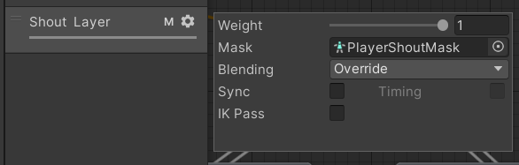

# 3.unity 常用功能

## （1）帧动画

动画帧事件是动画在执行到某一帧的时候调用一个函数，可以用来实现走路动画播放脚步声，开枪动画发射子弹等功能。


### 使用步骤

1.选择要插入事件的帧数（位置）
2.点击左边白色方块
3.输入Function(函数名)
4.输入参数(没有可以不输入)
5.在播放动画的物体上的脚本中写入同名函数
例如：


```csharp
public void PlayShoutAuio()
    {
        AudioSource.PlayClipAtPoint(shoutAudioClip,transform.position);     
    }
```

## （2）动画层（骨骼遮罩）

作用：
当角色要同时播放两个动画片段时，在一个动画层中就无法实现了，可以通过两个动画层进行动画叠加来实现

### 动画层设置



#### Weight(权重)

如果为0则不会执行，设置为1时会直接执行这个，设置为0.5时只会做一半的动作

#### Mask(动画遮罩)

每个动画需要整个模型同时做动作，即使某个部位没有动也会使用到这个部位，所以如果不设置遮罩的话不同动画层会相互抢模型，可以设置下面的层只能移动某个部位（胳膊、腿），这样就可以叠加到上面的层不出问题

#### Blending(融合类型)

- Override:重写，替换掉原来的
- Additive:叠加，大概率会出bug

### 动画层使用步骤

1.添加动画层
2.添加对应的动画，设置好动画参数以及切换
3.设置动画遮罩（可以直接更改动画中的遮罩，也可以创建一个骨骼遮罩）
4.
创建好骨骼遮罩 设置可以动的部位，添加到动画层设置的Mask中。

## (3)射线检测触发器

当发射的射线被触发器挡住，同时又不想让射线检测到触发器。


## 创建中文字体

### 1.下载字体

[谷歌字体](https://fonts.google.com/)
[字体天下](https://www.fonts.net.cn/fonts-zh-1.html)
[100字体](https://www.100font.com/)

### 2.转换字体


点击Font Asset Creator


## 画布常用设置

1.改变画布大小

2.画布模式
（1）Screen Space-Camera顾名思义，此模式我们需要一个Camera，这个相机的作用就是把它所投射获取到的界面当做UI界面
（2）Screen Space -OverLay 始终显示在最前面
（3）World Space就更简单了，就是把UI当做三维物体来处理。
3.改锚点
