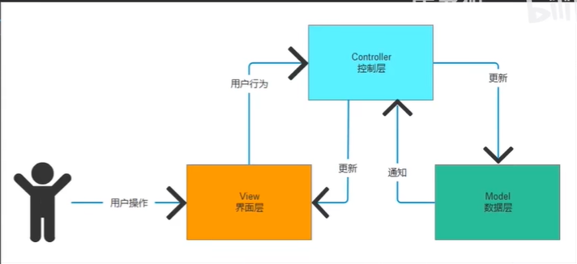

# MVC

MVC模式
MVC模式是软件工程中常见的一种软件架构模式，该模式把软件系统（项目）分为三个基本部分：模型（Model）、视图（View）和控制器（Controller）。

使用MVC模式有很多优势，例如:简化后期对项目的修改、扩展等维护操作；使项目的某一部分变得可以重复利用；使项目的结构更加直观。

具体来讲，MVC模式可以将项目划分为模型（M）、视图（V）和控制器（C）三个部分，并赋予各个部分不同的功能，方便开发人员进行分组。

（1）视图（View）：负责界面的显示，以及与用户的交互功能，例如表单、网页等。

（2）控制器（Controller）：可以理解为一个分发器，用来决定对于视图发来的请求，需要用哪一个模型来处理，以及处理完后需要跳回到哪一个视图。即用来连接视图和模型。

实际开发中，通常用控制器对客户端的请求数据进行封装（如将form表单发来的若干个表单字段值，封装到一个实体对象中），然后调用某一个模型来处理此请求，最后再转发请求（或重定向）到视图（或另一个控制器）。

（3）模型（Model）：模型持有所有的数据、状态和程序逻辑。模型接受视图数据的请求，并返回最终的处理结果。

- M 模型层：用来存放数据,将这个面板上要显示的/看不到的数据都存放在这一个脚本中，设置数据发生改变时的事件
- V 视图层：用户看到的东西/找组件
- C 控制层： 