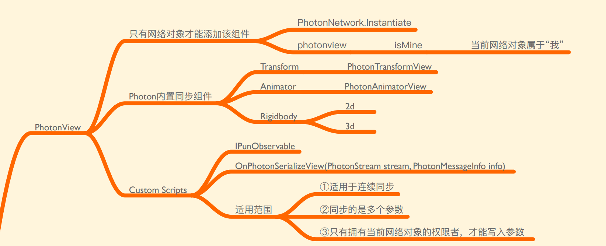
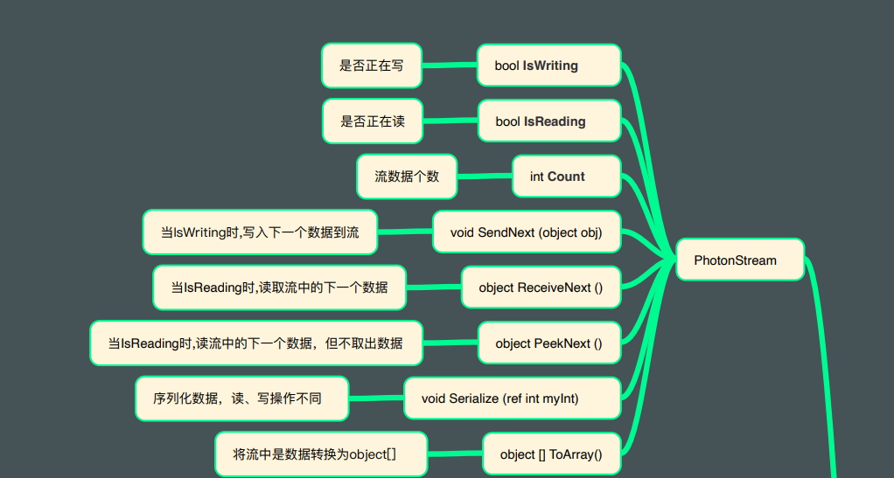
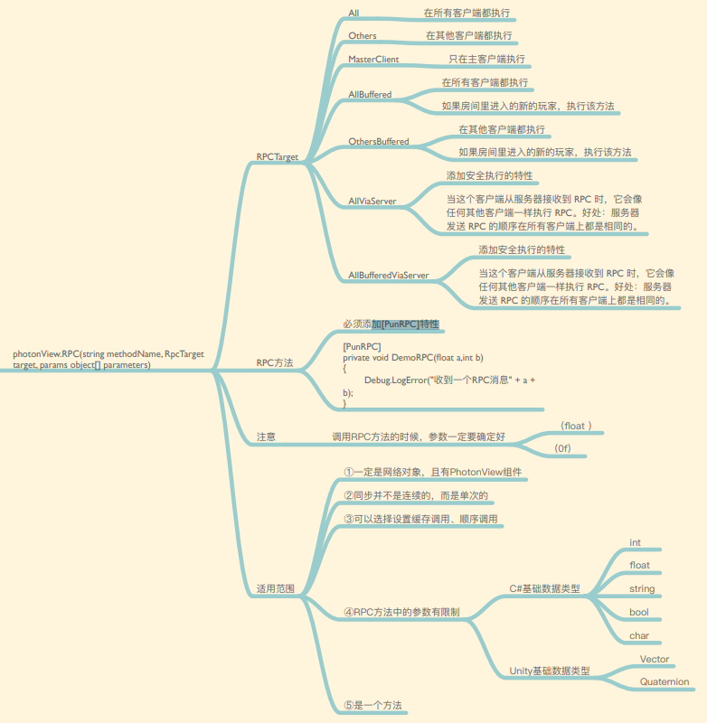

# 同步

## 1.使用属性同步

玩家和房间有属性这个东西，属性用hashtable来存储，主要用于进入游戏前同步

## 2.photon view

transform、animator和Rigidbody可以通过直接添加预设的脚本进行同步，如果要同步自定义的脚本，在脚本中实现IPunObservable接口
通过写于读来实现同步

## PhotonView.RPC()

同步方法，在要同步执行的方法前添加[PunRPC]特性，标记为同步方法
使用PhotonView.RPC()来调用

## PhotonNetwork.RaiseEvent

这个方法只需要传入方法的id，要传递的参数，谁接受到这个事件，和可靠性
发起事件后，回调函数IOnEventCallback会收到这个事件，一般来说会有多个事件同时注册，为了防止混乱，这里可以通过switch判断事件的id来执行不同的方法。
[官方文档](https://doc.photonengine.com/zh-cn/pun/current/gameplay/rpcsandraiseevent)
