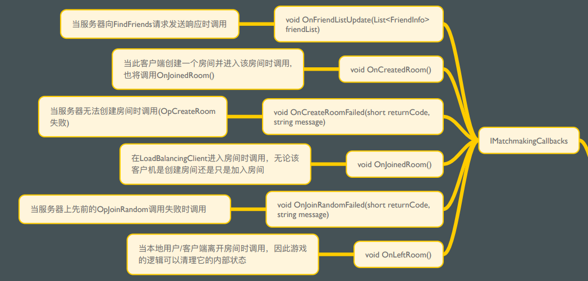
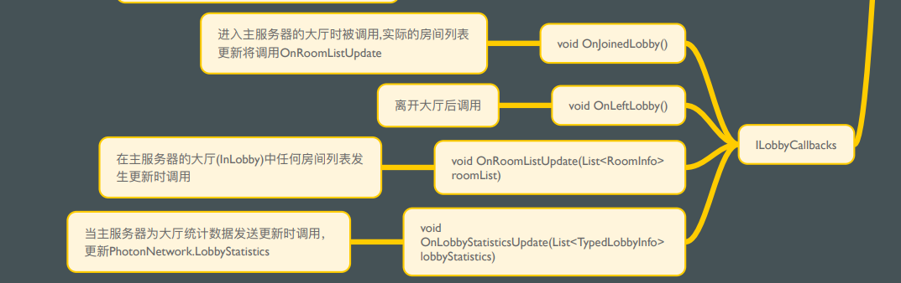

# 回调函数

## MonoBehaviourPunCallbacks

这个类实现了所有的回调的接口，如果脚本只需要继承MonoBehaviour并且用到了对应的回调函数可以直接继承这个类。

### IMatchmakingCallbacks

主要使用的回调有

- void OnCreatedRoom() 当此客户端创建一个房间并进入房间时调用
- void OnJoinedRoom() 在LoadBalancingClient进⼊房间时调⽤，⽆论该客户机是创建房间还是只是加⼊房间
- void OnLeftRoom() 当本地⽤户/客户端离开房间时调⽤，因此游戏的逻辑可以清理它的内部状态

### ILobbyCallbacks

主要使用的回调有：

- void OnJoinedLobby() 进⼊主服务器的⼤厅时被调⽤,实际的房间列表更新将调⽤OnRoomListUpdate
- void OnLeftLobby() 离开大厅后调用
- void OnRoomListUpdate 房间列表发生更新时调用
