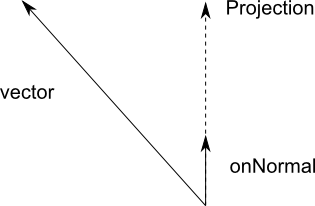
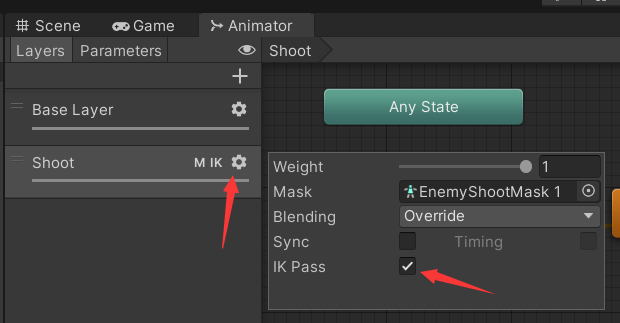
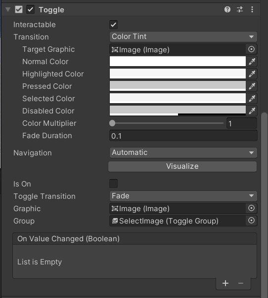
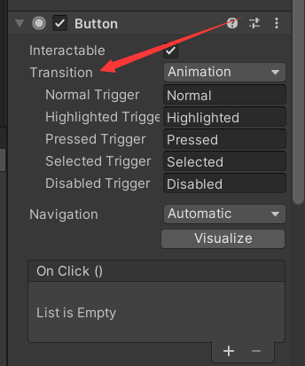
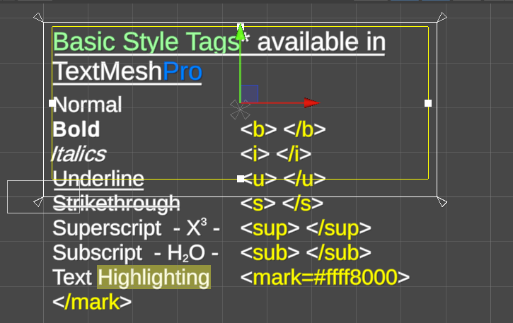
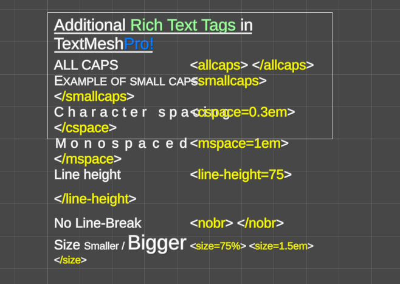
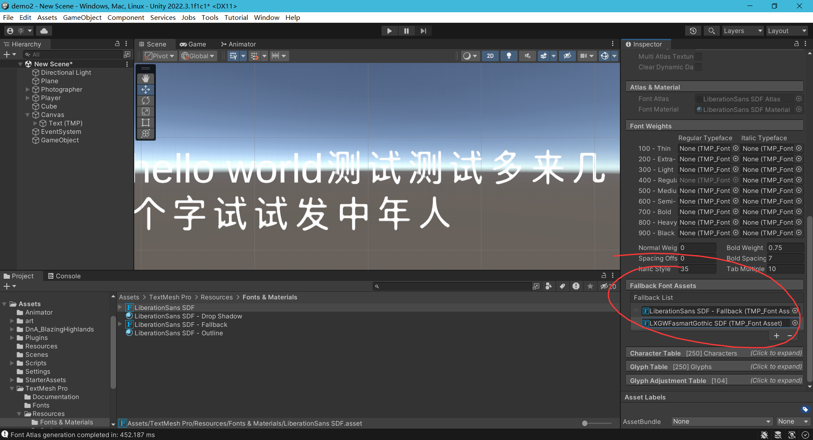
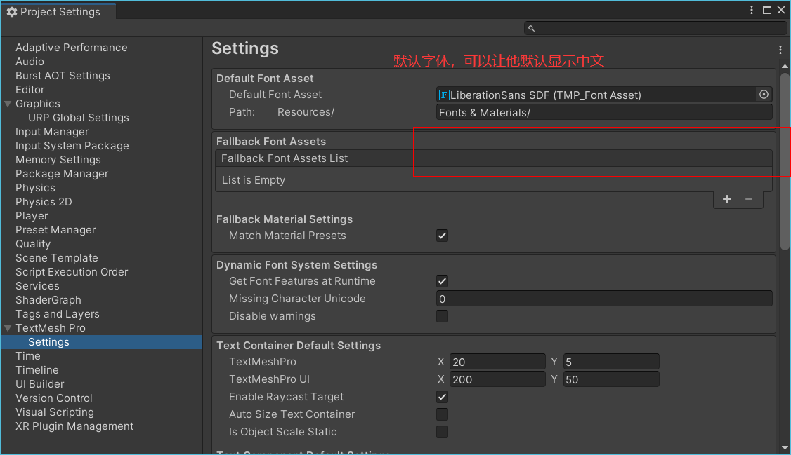
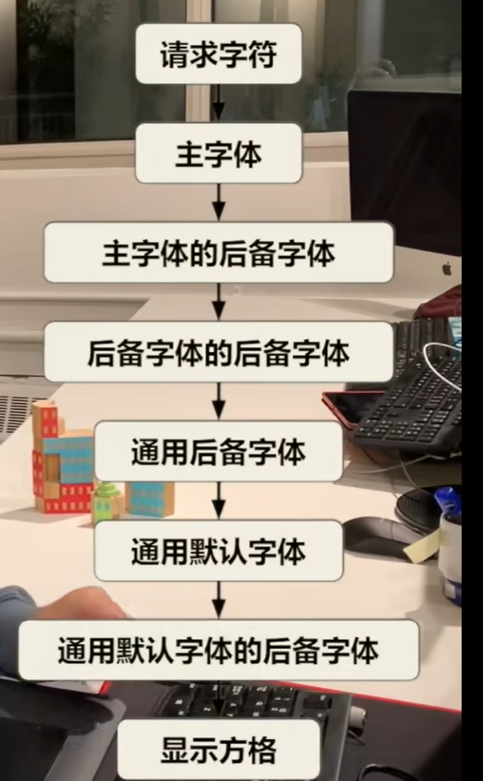

# 组件常用api

## Nav Mesh Agent(导航组件)

### agent.SetDestination() 导航到目标点

public bool SetDestination (Vector3 target);
target 要导航到的目标点.
如果可以导航到返回true,不可以返回false

### agent.desiredVelocity（） 导航的期望速度

### agent.remainingDistance 导航剩余距离

## Vector3(三维向量)

### Vector3.Project（） 计算投影

public static Vector3 Project (Vector3 vector, Vector3 onNormal);
将向量投影到另一个向量上。
要理解向量投影，请想象 onNormal 位于一条指向其方向的线上。 这条线上有一个最靠近 vector 尖端的点。 投影不过是重新缩放 /onNormal/，以使其到达线上的那个点。


## animator（动画组件）

### void OnAnimatorMove()回调函数

>用于处理动画移动以修改根运动的回调。
该回调在处理完状态机和动画后 （但在 OnAnimatorIK 之前）的每个帧中调用。

### animator.deltaPosition 计算根动画位移

>获取上一个已计算帧的化身位置增量。
每帧的位移，除以时间等于速度。

### OnAnimatorIK(int layerIndex) 回调函数

在即将调用IK动画之前执行，可以用来设置IK目标的位置和权重

### IK动画使用步骤

1.先设置某一个动画层是否启用IK

2.在代码中先设置iK权重（表示开启不开启）

```csharp
animator.SetIKPositionWeight(部位，权重)
```

>public void SetIKPositionWeight (AvatarIKGoal goal, float value);
goal 设置的 AvatarIKGoal。
LeftFoot 左脚。
RightFoot 右脚。
LeftHand 左手。
RightHand 右手。

例如：
设置右手的位置权重为1：
animator.SetIKPositionWeight(AvatarIKGoal.RightHand, 1);
3.设置ik的位置

```csharp
animator.SetIKPosition(AvatarIKGoal.RightHand, transform.posion);
```

括号中参数为 (部位，ik注视点)
4.重复步骤2-3，设置旋转、看向的点
SetIKRotationWeight()
SetLookAtWeight()
SetIKRotation()
SetLookAtPosition()：主要表现为看向指定方向（转头）

## toggle组件（切换组件）

可以从来做多选框，在多个选项中选择一个

常用选项：
Interactable:是否可以选择
Is On:是否被激活
Graphic：被选中时显示的图片（添加到里面后未被选中时不会显示）
gruop：可以将多个toggle加入到一个gruop中，只能选中其中的一个

### onValueChanged

面板上添加时，这个只会检测到值是否变化，并不能检测到他的值是否为true or false，所以如果要接收他的值是否为true（或者false），应该在脚本中添加事件监听，例如：

```csharp
void Awake()
    {
        //添加监听
        GetComponent<Toggle>().onValueChanged.AddListener(OnValueChanged);
private void OnValueChanged(bool value)
    {
        if (value)
        {
            //要执行的事件
        }
  
    }
```

## mask（ui中的mask遮罩）

遮罩不是挡住后面的，是只显示挡住的，
创建一个圆形的遮罩，在这个圆形遮罩下面创建子物体Image，Image只会显示mask的范围，超出范围的将不会显示，可以用来制作圆形头像（头像文件可以不用裁剪，直接替换就可以）

### 绝对值

Mathf.ABS(float value);

## transform

### 绕某点旋转

```c#
 child.RotateAround(transform.position（绕的旋转的点）, Vector3.back（绕那个轴旋转）, 1（旋转的角度）);
```

### 调整面板成为第一个子物体

transform.SetAsFirstSibling();

## buttom

1.用动画来实现按钮点击/按下时的效果

在这里选择animation，创建一个动画状态机，设置好对应的动画

## canvas gruop（画布组）

1.修改aloha值可以直接修改该组件下的所有子物体的aloha值
2.Interactable可以修改面板下的所有组件的可交互性
3.Blocks RayCasts 可以控制所有子物体是否能被射线检测到，也可以用来控制交互
4.Ignore parent Group 是否忽略父级的gruop,可以用来控制一个面板上除了这个物体以外所有物品透明等效果

## TMP_TEXT

1.可以在text中的文字前面输入<>来改变文字的颜色和样式，常用的样式如下：
<colro=#ff0000>输入文字</color> 改变颜色
\<b>输入文字 加粗\</b>结束加粗
\<i>输入文字 斜体
<size=72>设置字号 <size=150%>设置为原字号的150%

### 重写TMP_text

在脚本中继承TextMeshProUGUI可以创建出属于自己的tmp_text,可以设计出自己的特效等效果。

### 预处理器 ITextPreprocessor

输入框处理输入的文字的接口
PreprocessText(String){}
这个方法中的string就是输入框中的文字
返回值是最终显示的文字

### 常用富文本



- 从上到下分别为
- 加粗
- 斜体
- 下划线
- 删除线
- 上标
- 下标
- 文字高亮



- 从上到下分别为
- 全部大写
- 小型大写字母
- 字间距
- 字符转换为等宽的字体
- 设置行间距
- 不自动换行
- 设置字体大小

### 自定义样式

在TextMeshPro/Resources/Style Sheets/Default Style Sheet这个文件中可以先预设好一些样式，在使用中可以直接输入\<style="样式的名字"> 输入的文字 \</style>来直接调用，免除了一个一个样式的输入

### sdf字体

将普通的字转换为贴图，获得full control
（说人话就是用text组件直接用字体制作出来的字放大会变模糊，并且不能和游戏内物体交互。
tmp做出来的字体可以无限放大不丢失精度，并且因为是贴图，可以和游戏内环境发生交互，例如光照反射
生成字体方法有两种，一个是静态字体，用那些子就把那些子做成贴图，如果放入的字体太多要提高像素，不然会看不清，但如果字体很多字体文件的大小会很大
另一种是动态字体，动态字体贴图内没有任何数据，但它会在你输入文字后从字库里面找到对应的字体实时生成贴图，虽然方便但是会消耗性能。
[字体介绍](https://www.bilibili.com/video/BV1Kr4y1T7XB/)

### 让英文字体显示中文

在字体文件中添加fallback（后备字体）来让英文字体遇到不能显示的中文时切换到中文字体




## 脚本化对象 scriptableObject

1.脚本中继承ScriptableObject
2.添加特性[CreateAssetMenu(fileName = "文件默认名称", menuName = "文件夹名/菜单中显示的名字")]

## Content Size Fitter 让组件大小适配内容

根据有多少内容来动态变化组件的大小
例如：文本框中使用时，根据不同的字体大小自动调整文本框大小
例如：Scroll View中根据有多少内容来自动拉伸
