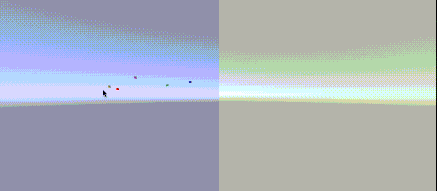

# 2.常用技巧

## 通过一个常数来替换虚拟轴/虚拟按键的string

eg：

```csharp
public class SystemDefine1
{
    #region Virtual Axis/Button 虚拟轴/虚拟按键
    //这里通过const来替换掉原来的字符串 可以直接补全 防止打错
    public const string HORIZONTAL = "Horizontal";
    public const string VERTICAL = "Vertical";
    public const string SNEAK = "Sneak";
    public const string ATTRACT = "Attract";
    public const string SWITCH="Switch";
    #endregion
    //这里直接使用了systemDefime1.Horizontal 可以直接调用，不用在双引号中输入字符串
    hor = Input.GetAxis(SystemDefine1.HORIZONTAL);
    ver=Input.GetAxis(SystemDefine1.VERTICAL);
}
```

## Animatior.StringToHash 同上 把动画状态机中的动画参数替换为HashID

>但是变量过多的时候，自己有可能会忘记，毕竟没有字符串的补全功能，而且值多了以后会设置String的方法效率比较低，会通过使用HashID的形式代替字符串进行索引设置。

eg:

```csharp
public class SystemDefine1 
{
#region Animation Parameters 动画参数
将动画参数设置为int值 后面再进行animator.setbool()/animator.Trigger()/animator.SetFloat()等时可以将string替换为这里的int值，以防写错
    public static int ANI_PARA_SPEED;
    public static int ANI_PARA_SNEAK;
    public static int ANI_PARA_DEAD;
    public static int ANI_PARA_SHOUT;

    #endregion
    //构造函数，为参数赋值
static SystemDefine1()
    {
        ANI_PARA_SPEED = Animator.StringToHash("Speed");
        ANI_PARA_SNEAK = Animator.StringToHash("Sneak");
        ANI_PARA_DEAD = Animator.StringToHash("Dead");
        ANI_PARA_SHOUT = Animator.StringToHash("Shout");
        ANI_STATE_LOCOMOTION = Animator.StringToHash("Locomotion");
    }

}

```

这个类中可以放入各种常用string值 ，在后面调用的时候使用这里的int

## 通过向量判断位置

坐标系中 一个点的坐标减去另一个点的坐标表示减数指向被减数坐标的向量
通常要获取一个点指向另一个点的方向，用另一个点来减这个点的坐标。

## 射线相关

>RaycastHit类用于存储发射射线后产生的碰撞信息。常用的成员变量如下：collider与射线发生碰撞的碰撞器
distance 从射线起点到射线与碰撞器的交点的距离
normal 射线射入平面的法向量
point 射线与碰撞器交点的坐标（Vector3对象）

### 发射射线的方法

```csharp
Physics.Raycast(Vector3 origin, Vector3 direction, float maxDistance= Mathf.Infinity, int layerMask= DefaultRaycastLayers, QueryTriggerInteraction queryTriggerInteraction= QueryTriggerInteraction.UseGlobal)
```

origin 射线在世界坐标系中的起点。
direction 射线的方向。
maxDistance 射线应检查碰撞的最大距离。
layerMask 层遮罩，用于在投射射线时有选择地忽略碰撞体。
queryTriggerInteraction 指定该查询是否应该命中触发器。

### 限制检测层数

layermask填入的是一个int值,但检测的是二进制中那一位是1
所以如果单纯填入第几层的话,转换成2进制可能不是想要的层
所以这里应该是填2进制
通过位运算例如:
1<<8,意思是将1向左移8个位置,结果是0000000100000000
填入这个就代表他检测第几层

## 计算角度

```csharp
Vector3.Angle(pos,pos2)
{
}
```

## 忽视ui中透明像素（鼠标悬停透明UI组件上不做检测设置

```csharp
    //透明度低于这个数值的图片都不参与检测
    Image.alphaHitTestMinimumThreshold=0.5f

```

>此 Alpha 阈值指定要将事件视为图像“碰撞”时像素必须具有的最小 Alpha 值。
小于阈值的 Alpha 值将导致射线投射事件通过图像。值 1 会导致只有完全不透明的像素在图像上注册射线投射事件。只使用从图像 Sprite 检索的 Alpha 值进行测试，图像 Graphic.color 的 Alpha 值将被忽略。
alphaHitTestMinimumThreshold 默认为 0；图像矩形内的所有射线投射事件均视为碰撞。
**为了使大于 0 的值能起作用，图像使用的 Sprite 必须具有可读像素。这可以通过在 Sprite 的高级纹理导入设置中启用 Read/Write enabled 并为 Sprite 禁用镶嵌来实现。**

## 判断组件是不是自己想要的

例如：
要找到进入触发器中带着特定组件的东西

```csharp
if (!other is CapsuleCollider)
                return;
```

## 通过导航来计算与目标点的距离（不是直线距离，是导航距离）

核心代码：

```csharp
nav.CalculatePath(player.position, path)
```

这行代码计算出当前位置到目标位置的导航路线（path为生成的路径）

```csharp
//存储着导航路上每个拐点的位置（Vector3[]存储）路径的角点。（只读）
path.corners
```

```csharp
        //通过导航的方式到目标位置需要那些拐点//拐点加上起点和终点
        Vector3[] wayPoints = new Vector3[path.corners.Length + 2];
        //设置起点
        wayPoints[0] = transform.position;
        //设置终点
        wayPoints[wayPoints.Length-1]=player.position;
        //设置拐点
        for (int i = 1; i < wayPoints.Length-1; i++)
        {
            wayPoints[i] = path.corners[i - 1];
        }
        //计算距离（计算每两个点之间的距离
        float distance = 0;
        for (int i = 0; i < wayPoints.Length-1; i++)
        {
            //叠加每一次计算出的距离
            distance+= Vector3.Distance(wayPoints[i], wayPoints[i + 1]);
        }
```

## 模拟怪物听觉（听到玩家脚步声）

通过判断进入感知范围内的玩家的动画状态，如果当前的动画状态发出声音就获取到玩家当前位置。

```csharp
void HearCheck()
    {
        //将动画状态转为HashId，方便下面比对
        int hash0 = playerAnimator.GetCurrentAnimatorStateInfo(0).shortNameHash;
        int hash1 = playerAnimator.GetCurrentAnimatorStateInfo(1).shortNameHash;
        //如果玩家发出了声音并且在感知范围
        //SystemDefine这个类存储的常用的hashid，详细查找（Animatior.StringToHash）
        if (hash0 == SystemDefine.ANI_STATE_LOCOMOTION || hash1 == SystemDefine.ANI_PARA_SHOUT&& GetDistanceWithPlayerByNav()<= sightDistance)
        {
            //听到了声音就去看看
            personalAlarmPosition = player.position;
        }
    }
```

## 向量叉乘判断左右 Cross(a, b)

计算两个向量的点乘，在左手坐标系下，如果向量b在向量a的右边（顺时针方向），则法向量的y为正值，如果在左边（逆时针方向），则法向量的
y为负值。


## 点乘判断前后

## 协程

>unity协程是一个能暂停执行，暂停后立即返回，直到中断指令完成后继续执行的函数。


### 使用方法

1.StartCoroutine(test1());
开启协程，要执行一个协程要从这里传入一个协程。
2.IEnumerator test1(){}
一个返回值为IEnumerator的方法
在这个方法中返回值通过yield return来返回
常用的返回值有

>yield是在不停的等待，等待后面的协程执行完成，如果yield return null，则等待一帧

3.StopAllCoroutine();停止协程
在某些情况下需要终止正在运行的协程，可以通过这个方法来结束
（传入的方法必须与开启协程传入的方法一致）

### 注意事项

1、不能再Update或者FixUpdate方法中使用协同程序，否则会报错。
2、关于中断指令：
中断指令/YieldInstruction,一个协程收到中断指令后暂停执行，返回上层执行同时等待这个指令达成后继续执行。

## ScriptableObject（右键菜单创建）

当一个类继承这个类的时候，可以在右键菜单crtet中创建一个类，可以用来创建大量的物品（例如装备）

### ScriptableObject使用方法

1.创建一个脚本，继承ScriptableObject
2.在类名之前加入

```csharp
[CreateAssetMenu(fileName="文件名，MenuName="文件夹名")]
```

3.写入想要保存的数据

## 获取未激活的组件

1.Transform.Find("游戏对象名")  
2.GameObject>FindGameObjectsWithTag("tag")
  GameObject.FindWithTag("tag")

## Mathf(数学类)

### 限制值范围

Mathf.Clamp(float value,float min,float max);

### 生成随机值

```csharp
Random.Range(0, 4);//生成整数
Random.Range(0f, 4f);//生成浮点数
```

## 方便控制UI坐标

可以将ui组件的锚点设置在左下角，这样ui的recrtransform.posion显示的就是屏幕坐标，可以方便的实现ui的位移或者跟随鼠标。
实现效果：


```csharp
rect.position = Vector3.Lerp(rect.position, new Vector3(Input.mousePosition.x, Input.mousePosition.y, 0), Time.deltaTime * speed);
child.RotateAround(transform.position, Vector3.back, 1);
mouseX= Mathf.Clamp( Mathf.Abs( Input.GetAxis("Mouse X"))*a,1,3);
mouseY = Mathf.Clamp(Mathf.Abs( Input.GetAxis("Mouse Y"))*a,1,3);
child.localScale = Vector3.Lerp(child.localScale, new Vector3(mouseX, mouseY, 0), Time.deltaTime * scaleSpeed);
```

## 接口

### IPointerDownHandler/IPointerUpHandler

鼠标按下/鼠标抬起

### IPointerEnterHandler/IPointerExitHandler

鼠标进去/鼠标移出
 
## 后台运行

 Application.runInBackground = true;

## 切换场景

SceneManager.LoadScene("StartMain 1");

## 反射

### 通过反射来调用私有无参构造

```csharp
Activator.CreateInstance(typeof(T),true);
``````

## 在没有继承MonoBehaviour每帧执行

通过事件event来事件这个效果
在一个继承了MonoBehaviour的类中创建一个2023年8月7日20:01:24，其他类中想要每帧执行的地方订阅这个事件，在这个脚本的update中调用这个事件，间接每帧调用了其他方法

```csharp
//继承了单例类
public class StateUpdateMono : SingletonBehabiour<StateUpdateMono>
    {
        /// <summary>
        /// 所有的更新事件
        /// </summary>
        private event Action allUpdateEvent; 
         public void AddUpdateEvent(Action action)
        {
            allUpdateEvent += action;
        }
        public void RemoveUpdateEvent(Action action)
        {
            allUpdateEvent -= action;
        }
        void Update()
        {
            allUpdateEvent?.Invoke();
        }
    }
```

## 代码常用路径

- 当前工程文件夹
Application.dataPath

## string.trim() 去除string中收尾的空格

[详细实现](https://blog.csdn.net/zhuzicc/article/details/121588517)

## String.IsNullOrEmpty(string)

指示指定的字符串是 null 还是空字符串 ("").

## 回调函数

回调函数指在程序设计中，将一个函数作为参数传递给另一个函数，并在另一个函数执行完毕后被调用的函数，在C#中，一般以委托形式出现
常见用法
在一个方法的参数中传入一个Action或者传入一个其他委托，代表这里需要传入一个其他地方的方法，当我现在这个方法执行到某个地方了，就需要执行一下传进来的委托，相当于通知一下别人说我这里好了，逻辑的具体实现在其他类中，这里不关心其他地方具体实现，只负责告诉别人我这里调用了。

## Convert.ToBoolean 将其他类型转换为bool

可以将其他各种类型的数据按照一定的规则转换bool值，例如将数字0转换为false，0以外的其他数字转换成true。详细规则查看官方文档
[官方文档](https://learn.microsoft.com/zh-cn/dotnet/api/system.convert.toboolean?view=net-7.0)

## GetAxis和GetAxisRaw的区别

這兩種功能都是用來取得軸向值的

假設我按W前進來移動人物

在沒有按鍵盤的情況下

兩種方法得到的值都是0

兩種方法的極大值跟極小值都是1與-1

如果使用Input.GetAxis
在剛開始按下W的時候取得的值會從0到1慢慢遞增
exp: 0 - 0.123 - 0.245 - 0.672 - 0.89 - 1.0
放開W取得的值會慢慢遞減
這種方法可以產生變化感,有一種加速跟煞車的感覺

如果使用Input.GetAxisRaw
取得的值永遠只有三種 -1,0,1
在按下w的時候取得的值會直接從0變成1
並不會有過渡的數值出來
這種方法因為數值固定,做出來的效果會很穩定

## 四元数*向量

代表将这个向量旋转多少度

- 注意事项
- 必须是四元数*向量,不能向量*四元数

## 位运算存储状态

```csharp
using UnityEngine;

public class Shelf
{
    private int itemMask; // 用于存储物品状态的位掩码

    public bool HasItemOnLayer(int layer)
    {
        if (layer < 0 || layer >= 32)
        {
            Debug.LogError("Invalid layer index.");
            return false;
        }

        int layerMask = 1 << layer;
        return (itemMask & layerMask) != 0;
    }

    public void SetItemOnLayer(int layer, bool hasItem)
    {
        if (layer < 0 || layer >= 32)
        {
            Debug.LogError("Invalid layer index.");
            return;
        }

        int layerMask = 1 << layer;

        if (hasItem)
            itemMask |= layerMask; // 设置对应位为1
        else
            itemMask &= ~layerMask; // 设置对应位为0
    }
}

```

## 在unity中Vector3无法设置默认参数

结构体不能直接设置默认参数
两种方法

-default(表示使用默认值)

```csharp
public void SpawnCube(Vector3 bar = default(Vector3))
{
    //it will make default value to be 0,0,0
} 
```

- ?Vector3 判断输入是否为空

```csharp
public void SpawnCube(Vector3? p = null)
{
    if (p == null)
    {
        p = Vector3.zero; //Set your default value here (0,0,0)
    }

}
```

## rigidbody模拟浮力

```csharp
using UnityEngine;

public class Buoyancy : MonoBehaviour
{
    // 阻尼系数，控制上浮的速度减缓
    public float damping = 0.1f;

    void FixedUpdate()
    {
        // 获取物体上的刚体组件
        Rigidbody rb = GetComponent<Rigidbody>();

        // 获取物体的质量
        float mass = rb.mass;

        // 获取重力
        Vector3 gravity = Physics.gravity;

        // 计算所需的浮力
        Vector3 buoyancy = -mass * gravity;

        // 施加浮力
        rb.AddForce(buoyancy, ForceMode.Force);

        // 阻尼效果，减缓上浮的速度
        rb.velocity *= (1.0f - damping);
    }
}

```

rb.velocity *= (1.0f - damping); 这行代码的作用是通过乘以 (1.0f - damping) 来减缓物体的速度。具体来说，它使用了衰减因子 damping，将物体的速度在每一帧都减小一定的比例。

假设物体当前的速度是 v，那么经过这行代码后，物体的新速度将变为 v * (1.0f - damping)。这就好比每一帧速度都减小了一定的比例，从而模拟了速度的减缓效果。

这样的操作可以用来模拟现实中的一些物理效果，比如在水中的物体上浮时，速度逐渐减小，直到物体达到平衡状态。
