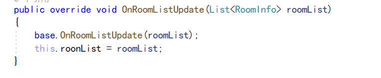

# 网络联机插件

## 使用步骤

1.项目中导入pun插件
2.

这里输入官网上申请的appid

## 创建一个游戏大厅需要的功能

1.连接服务器，显示当前连接状态
2.通过不同的状态显示不同的面板，例如未连接显示连接按钮，已连接显示加入房间等功能
3.写各各面板的功能
3.1 创建房间
需要输入房间名称和房间最大人数
3.2 加入大厅
3.3 随机加入房间
4.加入房间后的操作
显示加入这个房间的所有玩家
显示玩家的装备状态
如果玩家已准备显示取消准备的按钮
如果未准备显示准备的按钮
一直显示离开房间的按钮
5.进入大厅的操作
显示当前所有房间的名字
显示加入房间的按钮
显示离开大厅的按钮

## 实现上述功能所用到的api

1.连接服务器

```csharp
//连接photon Cloud 使用这个方法可以连接到配置文件中的云服务器 返回值未是否连接成功
 bool connectResult = PhotonNetwork.ConnectUsingSettings();
``````

2.显示当前状态

```csharp
//返回一个ClientState类型的变量 这是一个枚举，存储了各种状态的枚举
PhotonNetwork.NetworkClientState
``````

在update中不断地对比状态可以显示当前处于什么状态

```csharp
private void Update()
    {
        //previoursState为上面定义的初始状态
        if (PhotonNetwork.NetworkClientState != previoursState)
        {
            //添加到队列
            photonState.Add(PhotonNetwork.NetworkClientState.ToString());
            //更新previous
            previoursState= PhotonNetwork.NetworkClientState;
        }
    }
``````

获取到当前状态之后可以根据不同的状态显示不同的面板了
这里用switch来判断

```csharp
switch (PhotonNetwork.NetworkClientState)
        {
            //未连接状态
            case ClientState.PeerCreated:
                ConnectToPhotonCloud();
                break;
            case ClientState.Disconnected:
                ConnectToPhotonCloud();
                break;
            //连接到主服务器 连接成功
            case ClientState.ConnectedToMasterServer:
                RoomOperation();//房间操作
           break;
            case ClientState.Joined:
                JoinedRoomOperation();//进入房间后的操作
                break;
            case ClientState.JoinedLobby:
                JoinedLobbyOperation();//进入大厅后的操作
                break;
            default:
                break;
        }
``````

3.创建房间
在创建房间的时候要先给玩家名字赋值，可以在初始界面让玩家输入

```csharp
PhotonNetwork.LocalPlayer.NickName = playerNickName;
``````

在创建时间时可以传入一个房间的配置，先实例化一个房间配置，设置好房间的属性

```csharp
 //房间设置
            //这里可以设置房间最大人数、房间是否可见等属性
            RoomOptions options = new RoomOptions(); 
            options.MaxPlayers = byte.Parse(roomMaxCount);
``````

配置好房间属性之后创建房间

```csharp
//创建房间
            PhotonNetwork.CreateRoom(roomName, options);
``````

4.加入大厅

```csharp
PhotonNetwork.JoinLobby();
``````

5.随机加入房间

```csharp
             PhotonNetwork.LocalPlayer.NickName = playerNickName;
            //随机加入房间
            PhotonNetwork.JoinRandomRoom();
            //随机加入房间，如果找不到就创建房间
            PhotonNetwork.JoinRandomOrCreateRoom();


``````

6.加入房间后显示的东西
（1）显示加入这个房间的玩家列表

```csharp
(数组)【已经排好序的，优先使用
PhotonNetwork.PlayerList
找到当前房间 再遍历所有玩家 （字典）
PhotonNetwork.CurrentRoom.Players
``````

两种方法获取当前房间的玩家，这里使用第一种
遍历显示每个玩家的昵称

```csharp
foreach (var item in PhotonNetwork.PlayerList)
        {
            //逐个显示每个玩家
            GUILayout.Label(item.ActorNumber + ":" + item.NickName );
        }
``````

显示完昵称之后再后面显示当前玩家的准备状态
并加一个按钮，已经准备显示取消，没准备显示准备按钮

```csharp
            //
            object isReady = false;
            //自定义属性 CustomProperties是一个哈希表 这里尝试获取ready，
            item.CustomProperties.TryGetValue("Ready", out isReady);
            //这里如果是第一次就会返回null，返回null则视为没准备
            if (isReady==null || !(bool)isReady)
            {
                //没准备 并且是自己 显示准备按钮
                if (item.IsLocal && GUILayout.Button("准备"))
                {
                    //实例化一个哈希表 这里要创建using ExitGames.Client.Photon;这个命名空间中的哈希表
                    Hashtable readyHash=new Hashtable();
                    readyHash.Add("Ready", true);
                    //设置准备属性
                    //将哈希表设置为自定义属性
                    item.SetCustomProperties(readyHash);
                }
                else
                {
                    GUILayout.Label("未准备");
                }
            }
            else
            {
                GUILayout.Label("准备");
                if (item.IsLocal && GUILayout.Button("取消装备"))
                {
                    Hashtable readyHash = new Hashtable();
                    readyHash.Add("Ready", false);
                    //设置准备属性
                    item.SetCustomProperties(readyHash);
                }
            }
``````

最后显示离开房间按钮

```csharp
if (GUILayout.Button("离开房间"))
        {
            //离开房间
            PhotonNetwork.LeaveRoom();
        }
``````

7.进入大厅显示的东西

显示房间列表
cbDemo.roonList是在另一个脚本中存储的房间列表
在另一个脚本中存储的回调函数

这里每次房间列表更新时都会调用这个回调函数，roomlist会更新为最新的房间

```csharp
 foreach (var item in cbDemo.roonList)
        {
            if (!item.IsOpen || !item.IsVisible)
                continue;
            GUILayout.Label("房间名称"+item.Name);
            GUILayout.Label("房间信息" + item.PlayerCount + "/" + item.MaxPlayers);
        }
`````````

显示加入房间的按钮

```c#
 if (GUILayout.Button("加入房间"))
            {
                PhotonNetwork.LocalPlayer.NickName= playerNickName;
                //加入房间
                PhotonNetwork.JoinRoom(item.Name);
            }
```

离开大厅的按钮

```csharp
if (GUILayout.Button("离开大厅"))
        {
            PhotonNetwork.LeaveLobby();
        }
``````
