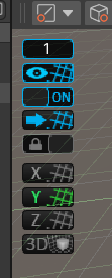
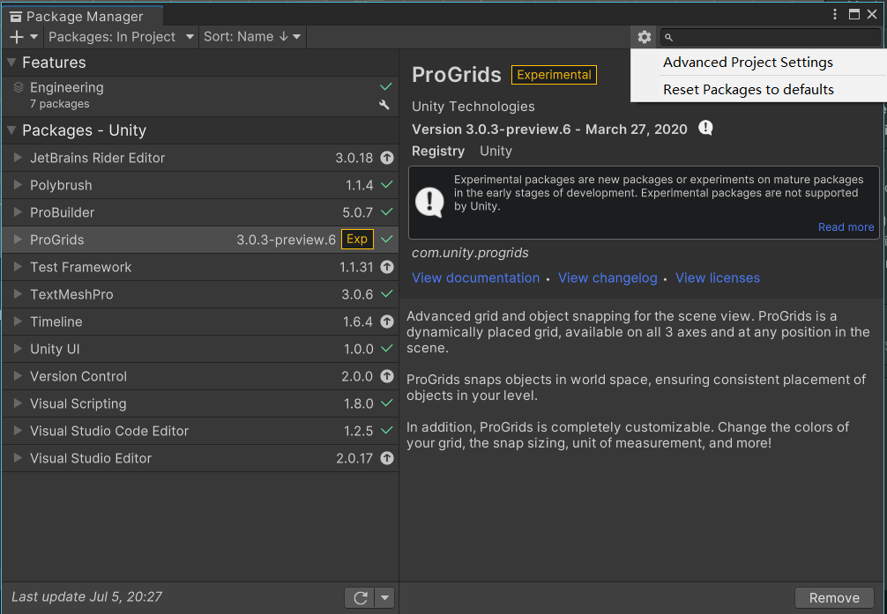
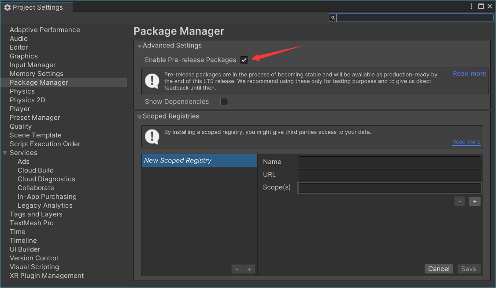
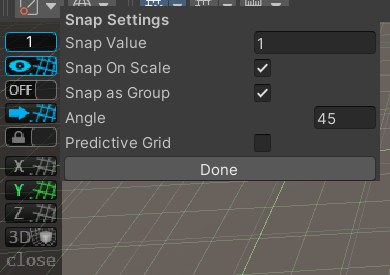
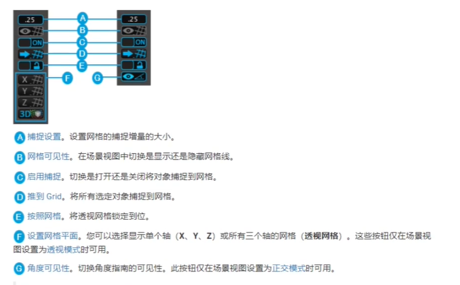
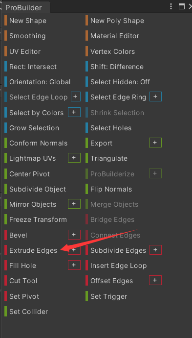
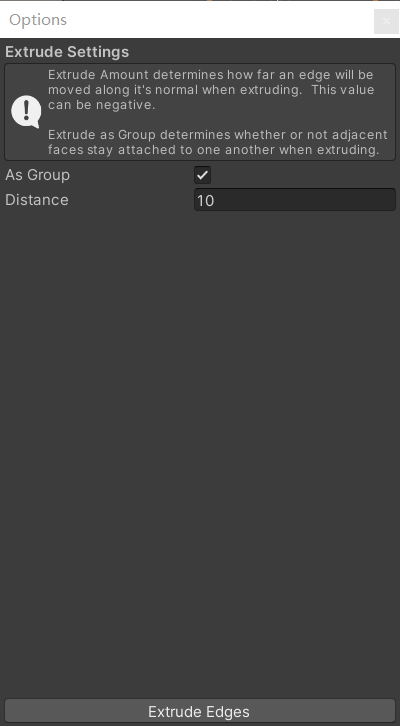
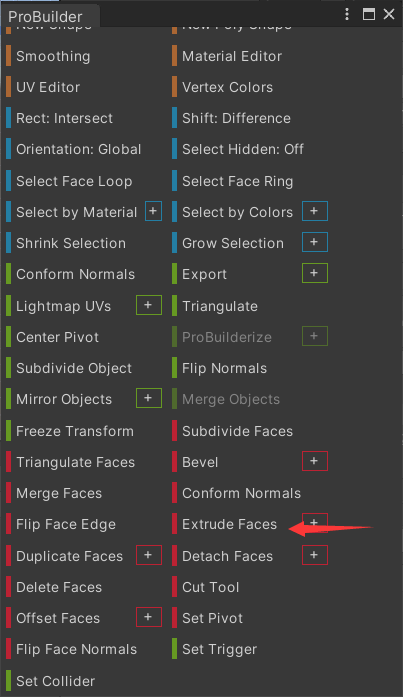
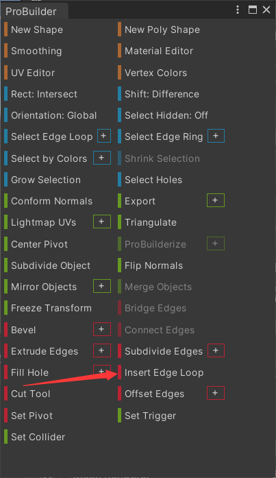
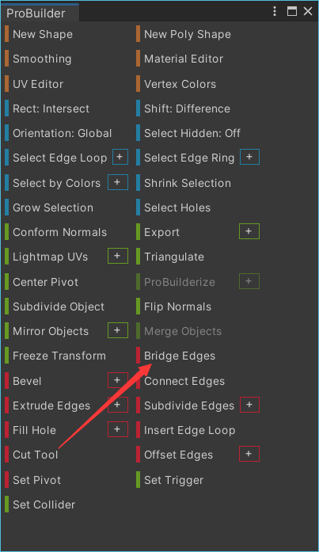

# unity官方插件

## 1.ProGrids

高级网格工具，方便定位，对齐，移动

### (1)安装方法

没有正式版，在package manager（包管理器）中无法直接搜索到。
步骤1：

点击上方齿轮，打开Project Settings
步骤2：

点击这里的允许预发售包。
步骤3：
如果依旧找不到可以在左上角加号中
com.unity.progrids

### （2）使用方法

Snap Value：吸附间隔（移动时每次移动的距离）
Snap On Scale:缩放时是否吸附。
Snap as Gruop:移动多个物体是保持他们的相对距离

[官方文档](https://docs.unity3d.com/Packages/com.unity.progrids@3.0/manual/install.html)
[视频介绍](https://www.bilibili.com/video/BV1er4y1D7Se/)

## 2.ProBulder

[官方文档](https://docs.unity3d.com/Packages/com.unity.probuilder@5.0/manual/index.html)

### 安装方法

在Packages:Unity Registry中直接搜索

### 使用方法

在安装后工具栏中的tool中打开主窗口

### 常用功能

#### 1.边的挤出

选择一个边，然后可以向外挤出一部分（线移动成面）

as group:Enable this option to keep the sides of extruded edges attached to each other if you select more than one edge to extrude.(如果选择多个要挤压的边，则启用此选项以保持挤压边的各个边相互连接。)

#### 2.面的挤出

使用方法同上

#### 3.边的环切

垂直于选中的线，创建一条新的线环绕整个模型

#### 4.补边

选中两条边，可以填充两个边中间空缺的面
