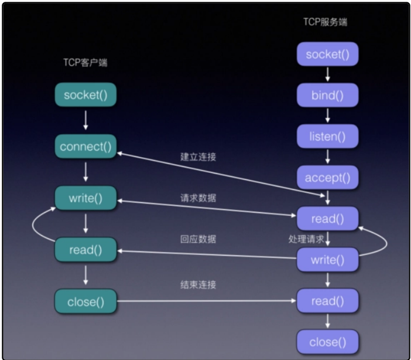

# 套接字的使用步骤


1.服务器端首先实例化服务器端的socket

```csharp
//实例化sockaet对象      //ipv4协议                套接字类型 字节流/数据报 （字节流使用tcp协议，数据报使用udp协议
serverSocket = new Socket(AddressFamily.InterNetwork, SocketType.Stream, ProtocolType.Tcp);
``````

2.绑定网络节点
先创建网络结点

```csharp
//创建网络结点                    ip地址        端口号
EndPoint endPoint= new IPEndPoint(IPAddress.Any,12321);
``````

//绑定网络结点

```csharp
serverSocket.Bind(endPoint);
``````

3.开始监听端口

```csharp
//设置监听长度//最多可以同时连接多少
serverSocket.Listen(20);
``````

4.开始异步接受客户端连接请求

```csharp
 serverSocket.BeginAccept(ServerAccept, serverSocket);
``````

在服务器中接受来自客户端的消息

```csharp
        private void ServerAccept(IAsyncResult ar)
        {
            //获取到异步状态中得到socket（客户端的socket）
            Socket workingSocket=ar.AsyncState as Socket;
            clientSockets.Add(workingSocket);
            //结束接受客户端的
            Socket connectedClient= workingSocket.EndAccept(ar);
            serverCallback($"接收到客户端{connectedClient.LocalEndPoint}!");

            //开启异步接受消息
            connectedClient.BeginReceive(
                serverBuffer,/*消息缓存*/
                0,/*消息接受的偏移量*/
                serverBuffer.Length,/*消息接受的长度*/
                SocketFlags.None,/*消息接受的标志位*/
                ServerReceive,/*异步消息接受回调*/
                connectedClient/*状态*/
            );

            
            //尾递归
            //开始异步接受客户端连接请求//再次开始接客
            serverSocket.BeginAccept(ServerAccept, serverSocket);

        }

        private void ServerReceive(IAsyncResult ar)
        {
            //获取到socket
            Socket workingSocket= ar.AsyncState as Socket;
            //结束接受
            int count= workingSocket.EndReceive(ar);
            serverCallback($"接收到客户端{workingSocket.LocalEndPoint}发送来{count}个字节的消息");

            //解析消息(基于utf-8编码解析字符串内容
            string msg= UTF8Encoding.UTF8.GetString(serverBuffer);

            serverCallback($"消息内容：{msg}");

            workingSocket.Send(serverBuffer);

            //清空buffer
            serverBuffer = new byte[1024];

            //开启异步接受消息
            workingSocket.BeginReceive(
                serverBuffer,/*消息缓存*/
                0,/*消息接受的偏移量*/
                serverBuffer.Length,/*消息接受的长度*/
                SocketFlags.None,/*消息接受的标志位*/
                ServerReceive,/*异步消息接受回调*/
                workingSocket/*状态*/
            );

        }
``````

5.客户端请求连接服务器
