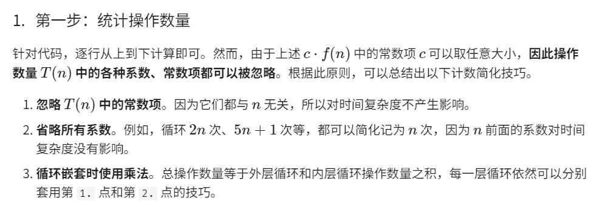
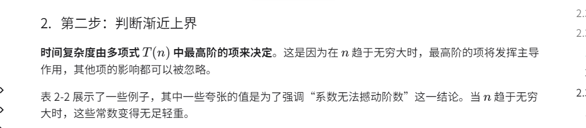
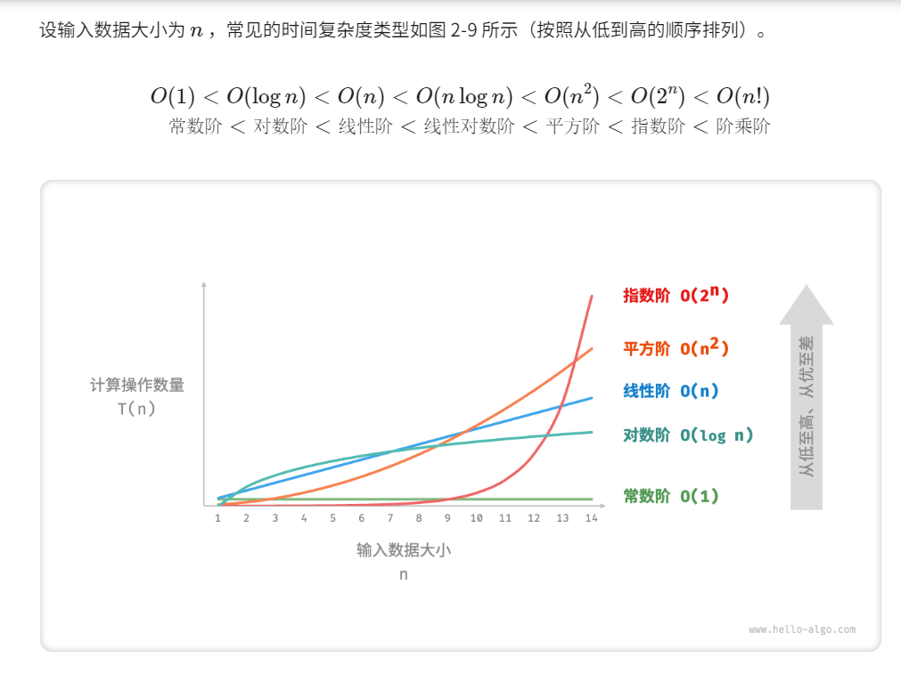
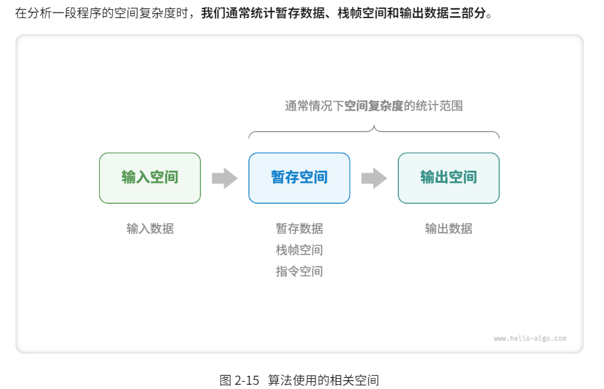
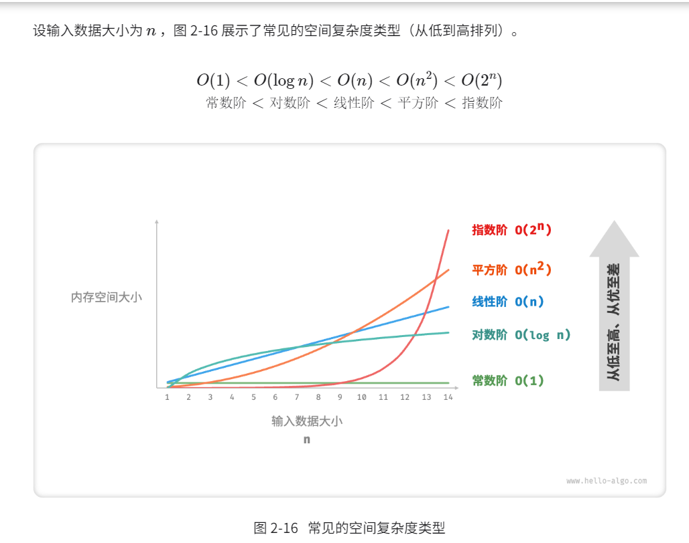
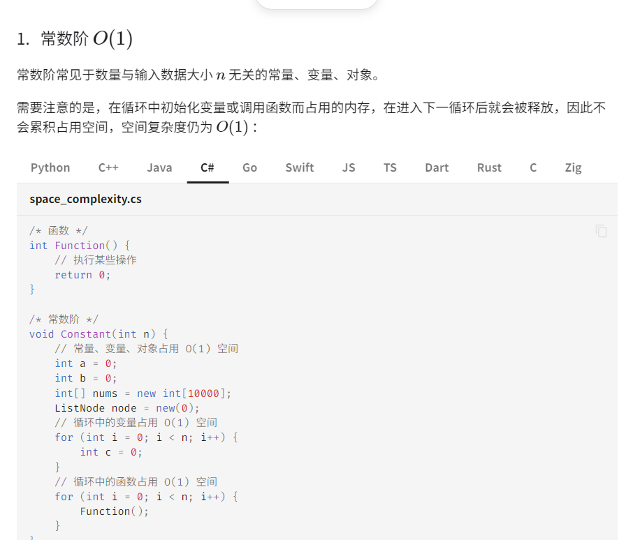
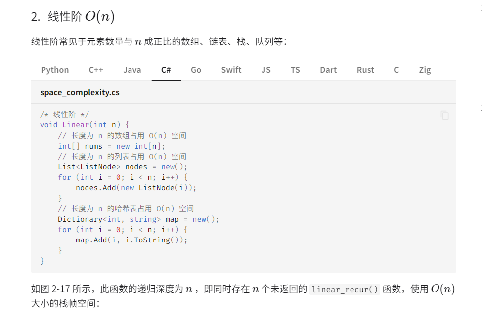
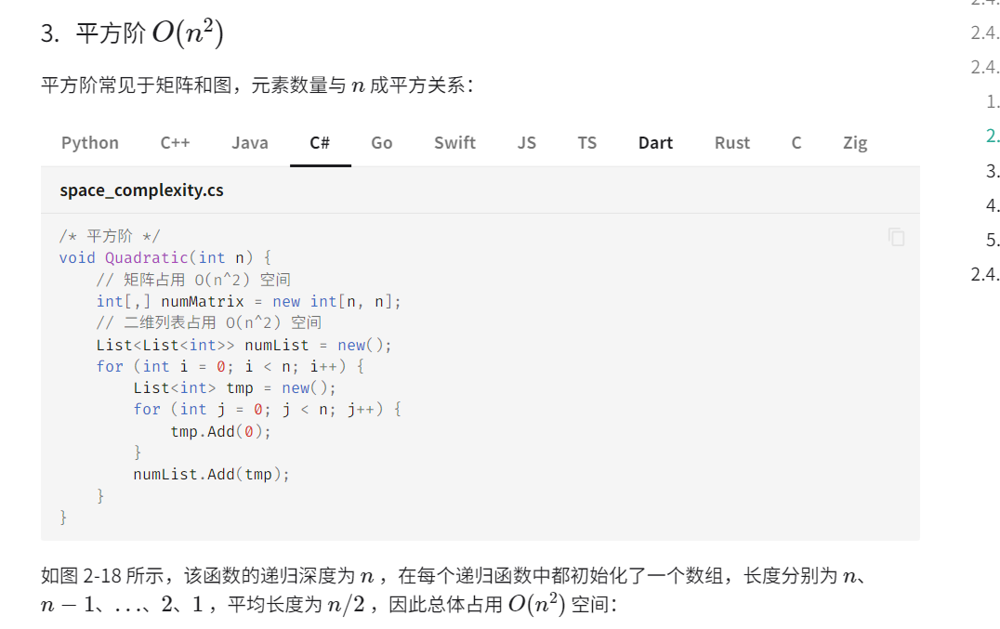
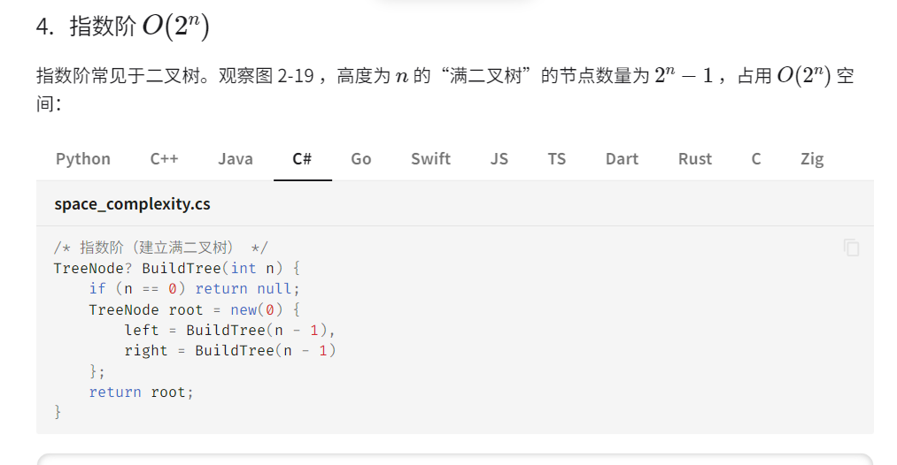
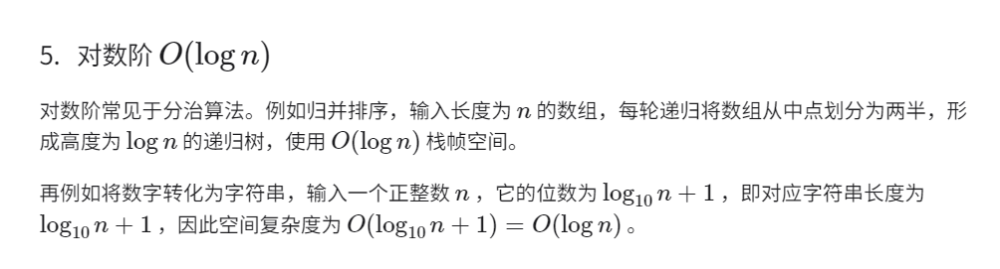

# 基本知识

## 时间复杂度

时间复杂度的本质是求一个函数的**渐进上界**
1.

### 时间复杂度类型

## 空间复杂度

一般情况下只关注最差空间复杂度,因为要留足所有数据的内存空间

### 常见空间复杂度

最常见的就是常数阶
数组,队列等可以存好多的就是线性阶n
存两个常阶的就是n^2,例如嵌套数组或2阶矩阵
指数最常见于树
对数常见于分治算法,主要思想是每次计算都分出来一半,每次存储的数据少一半.

## 时间复杂度和空间复杂度总结

时间复杂度和空间复杂度很难同时达到最优
通常情况下都是牺牲时间换空间或者牺牲空间换时间
通常情况下时间比空间重要
